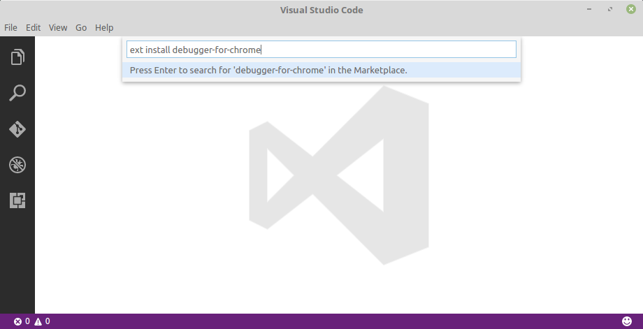
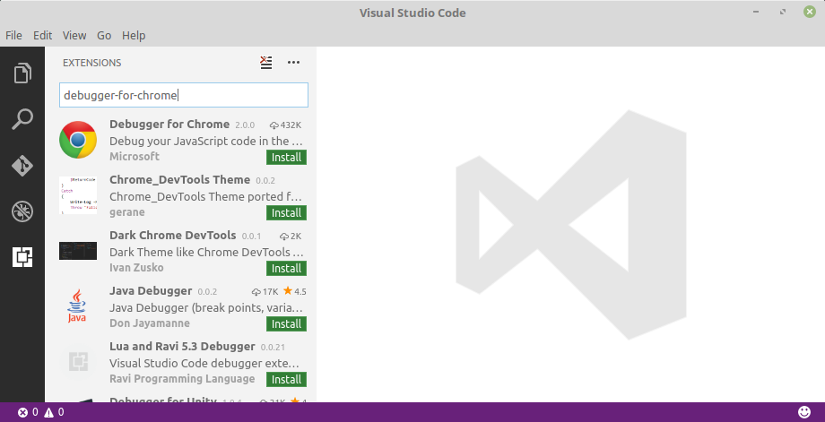
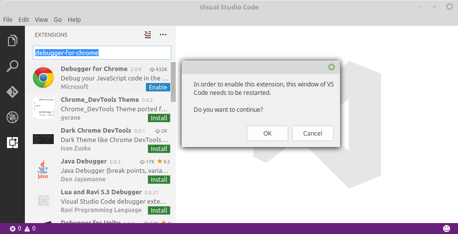

# Debugging with Visual Studio code

In this guide we'll show how to debug client side JavaScript applications in VS Code.

To do this, we'll use [Debugger for chrome](https://github.com/Microsoft/vscode-chrome-debug)
a VS Code extension to debug JavaScript code in the Google Chrome browser, or other targets that support the
[Chrome Debugging Protocol](https://chromedevtools.github.io/debugger-protocol-viewer/).

## Summary Steps

1. Install `Debugger for chrome` extension.
2. Configure the extension.
3. Debug JavaScript code.

## Install

First of all, install the [VS Code Debugger for Chrome Extension](https://marketplace.visualstudio.com/items?itemName=msjsdiag.debugger-for-chrome).

Launch VS Code, press `Ctrl+P`, paste the following command, and press enter.

```
ext install debugger-for-chrome
```





After that, enable the extension (You will prompted to restart VS Code in order to enable the extension).




## Configuring the extension


## Debugging JavaScript code
