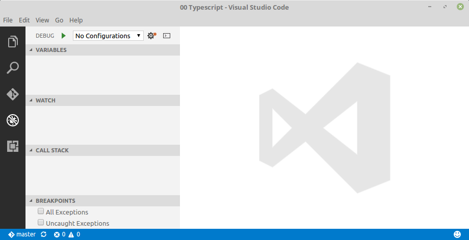
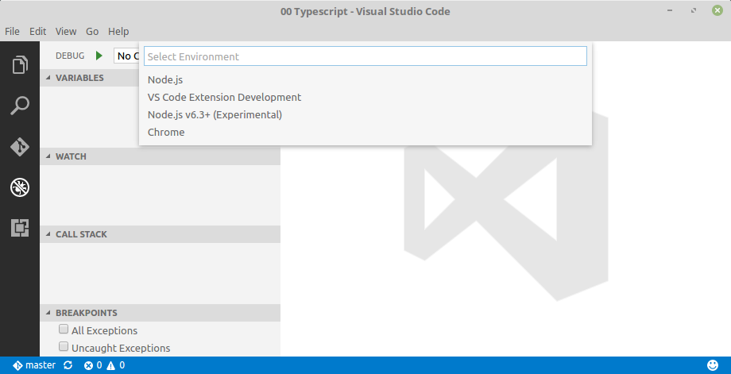
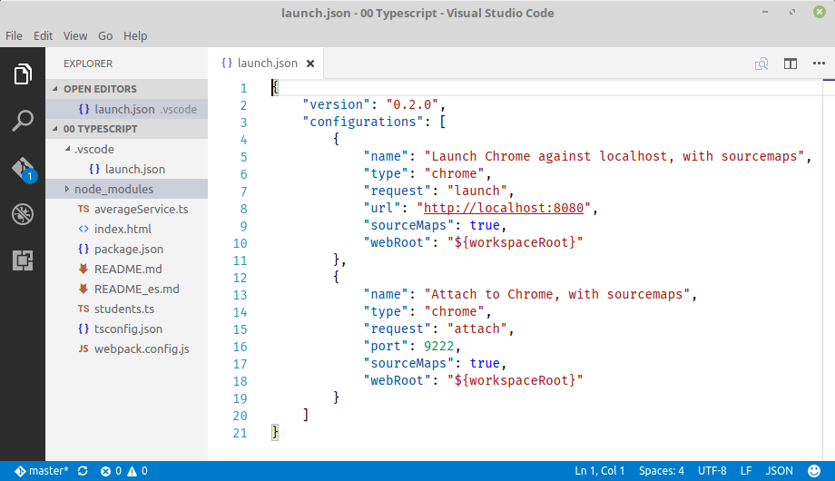
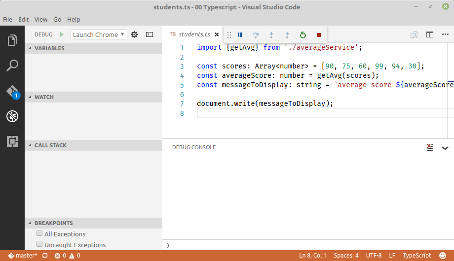
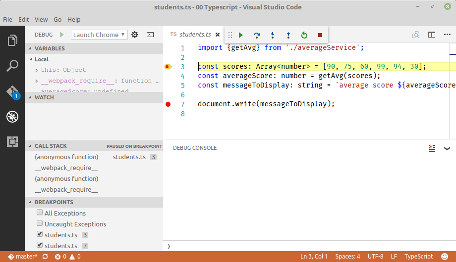
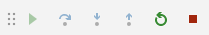

# Debugging with Visual Studio code

In this guide we'll show how to debug client side TypeScript applications in VS Code.

To do this, we'll use [Debugger for chrome](https://github.com/Microsoft/vscode-chrome-debug)
a VS Code extension to debug JavaScript code in the Google Chrome browser, or other targets that support the
[Chrome Debugging Protocol](https://chromedevtools.github.io/debugger-protocol-viewer/).

## Summary Steps

1. Install `Debugger for chrome` extension.
2. Configure the extension.
3. Debug TypeScript code.

## Install

First of all, install the [VS Code Debugger for Chrome Extension](https://marketplace.visualstudio.com/items?itemName=msjsdiag.debugger-for-chrome).

Launch VS Code, press `Ctrl+P`, paste the following command, and press enter.

```
ext install debugger-for-chrome
```


After that, enable the extension (You will prompted to restart VS Code in order to enable the extension).


## Configuring the extension

To use this extension, you must first open the folder containing the project you want to work on.

> In this guide we are using the sample **"02 FX / 00 TypeScript"** from the GitHub project [Webpack 1.x samples](https://github.com/Lemoncode/webpack-1.x-by-sample) by [Lemoncode](http://www.lemoncode.net/).

Click now on the debug icon in the sidebar or press `CTRL+SHIFT+D`.



Then click on the gear icon next to the debug button in the upper left and select `Chrome`.



This opens the debug configuration settings (in `.vscode/launch.json`) with de default
configuration settings.



The extension operates in two modes:
* `launch` - Launch an instance of Chrome and navigate to your app.
* `attach` - Attach to a running instance of Chrome (with remote debugging enabled).

## Debugging TypeScript code

Now we are ready to debug our TypeScript application.

Pick a launch config from the dropdown on the Debug pane in VS Code. Press the play
button or `F5` to start.

The Chrome browser will start opening our application. You can then set watchers, breakpoints (or disable them), see the call stack, or examine local variables.






You can step through the code using the debug menu in the top middle of VS Code.



or using the following shortcuts keys:

* `F5` continue
* `F10` step over
* `F11` step into
* `SHIFT+F11` step out
* `CTRL+SHIFT+F5` restart
* `SHIFT+F5` stop
